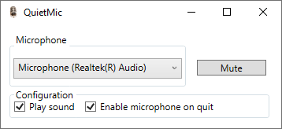

# QuietMic 🎙️

QuietMic is an application allowing you to globally toggle the state of your microphone. \
I originally developed it in order to use keyboard shortcut to mute my microphone when someone makes noise when I'm in livestream. \
This is my first ever C# application, therefore my first WPF application too.

For now, this application works, but it is really basic. I plan to work on it more, but for now it is enough for my needs.

## Features

* Select one microphone in your microphone list
* Toggle the mute status of your selected microphone using Alt+PageUp
* Optional sound notifications (one for mute status, another for unmute status) when using keyboard shortcut
* By default, the microphone is reactivated when closing the application

## Work in progress

* I'm working on a tray menu: for now, only the icon is here
* Some other ideas I will implement one day

## Screenshots

